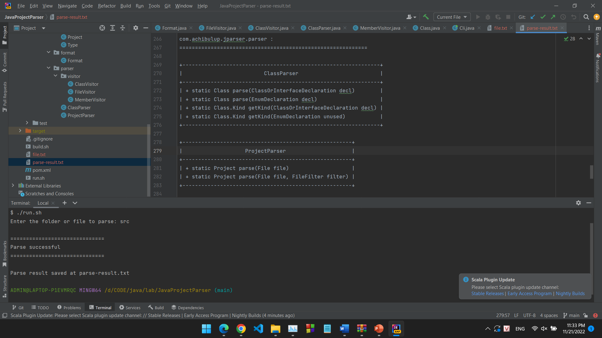

# Java project parser

This is a simple project helps parse your java projects and files into package and class structures. There's also a command line program to output the structure in UML-like format.

## Setup
Currently, this project is not integrated in any build systems :(, I may do it later.

### Build and run

To simply run the command line program, just run the script run.sh, which use the Maven build system.
Or, you can run the build.sh script, it will create the program in the cli folder. You can then run the program with run.sh, which requires java only.

Demo picture:
